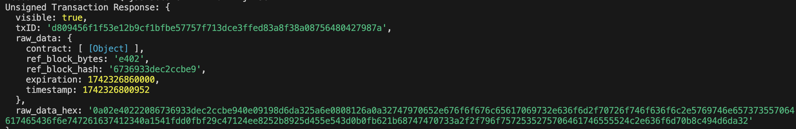

# WITNESS (SR) Scripts

### URL  Update

This is a simple script to update your SR URL information.

```bash
git clone this repo
cd updatewitness
npm install | yarn install
cp .env.sample .env    #After .env file is created paste your private key in the PRIVATE_KEY variable
node updatewitness.js
```

You should get a response like this:



Provided your private key matches the SR one, you should see a success together with a txn hash.


Any code contribution is welcomed!
